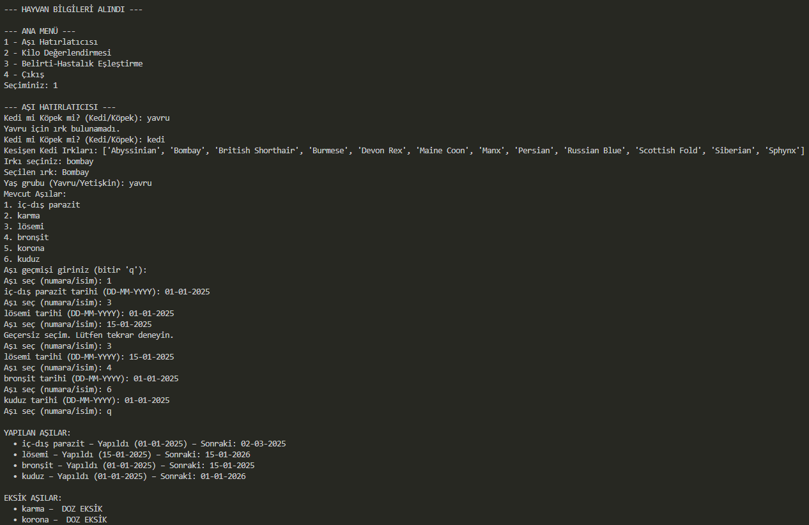
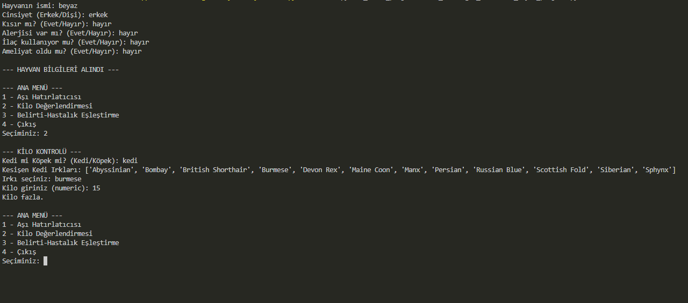

#  cansu_torunoglu_veteriner_kaydi_projesi

##  Projenin Tanımı 

Bu Python projesi, kedi ve köpek patili dostlarımız için terminal tabanlı bir Veteriner Takip Sistemi sunar. 

Uygulama, aşı takvimi hatırlatıcısı, kilo kontrolü ve hastalık-belirti eşleştirme modüllerinden oluşur. Kullanıcıdan alınan bilgiler doğrultusunda analiz ve tavsiyeler sunar.

## Projenin Amacı

Hayvan sağlığına dair önemli bilgileri dijital ortamda bir araya getirerek:

- Aşı takibini kolaylaştırmak

- Sağlıklı kilo aralıklarına dikkat çekmek
  
- Semptomlara göre olası hastalıkları önceden tahmin edebilmek
  
amaçlarıyla geliştirilmiştir.

## Hangi Sorunlara Çözüm Sunar?

Aşı tarihi ne zamandı? sorusuna otomatik yanıt.

Aşırı kilo/kilo düşüklüğünü erken fark etme

Belirtilere göre hastalık tahmininde bulunur.

İlaç kullanımı, alerji ve ameliyat geçmişi takibi yapar.

Not : Verilerin kesişimi ile yalnızca güvenilir ve desteklenen kedi/köpek ırkları işleme alınır.

##  Kullanım Senaryosu

1- Kullanıcı uygulamayı başlatır ve hayvan bilgilerini girer.

 İsim, cinsiyet, kısırlık durumu, alerji/ilaç/ameliyat bilgileri
 
2- Ana menüden bir modül seçilir:

   -Aşı Hatırlatıcı
   
   -Kilo Kontrolü
   
   -Belirti-Hastalık Eşleştirme
   
3- İlgili veri alınır ve analiz gerçekleştirilir

4-Sonuçlar kullanıcıya metin olarak sunulur


## Kurulum

1. Python 3.10+ kurulu olmalı.
   
2. Gerekli Kütüphaneleri Kurun.
   ```bash
   pip install pandas requests openpyxl
   
  --Kullanılan kütüphaneler-- 
   
  pandas = CSV ve Excel gibi tablo formatlı dosyaları okur, yazar ve düzenler.
  
  requests = İnternetteki (GitHub gibi) bir dosyayı program içine çeker (download gibi ama kodla).
  
  openpyxl = .xlsx uzantılı modern Excel dosyalarını pandas ile birlikte okuyabilmek için kullanılır.

  datetime = Python’un yerleşik modülüdür. Aşıların bir sonraki tarihini hesaplamak için tarih işlemleri yapılır.
  
  io = İnternetten gelen Excel dosyalarını pandas ile açabilmek için bellek içi byte akışını sağlar.
  
3. Reponun Klonlanması.
   
    ```bash
   git clone https://github.com/CansuTorunoglu/veterinerlik_kaydi_otomatiklesmis_sistem.git
    
  ###  Alternatif Yöntem: GitHub üzerinden indirme (Git kullanmadan)

1. Proje sayfasına git:  
   [https://github.com/CansuTorunoglu/veterinerlik_kaydi_otomatiklesmis_sistem](https://github.com/CansuTorunoglu/veterinerlik_kaydi_otomatiklesmis_sistem)

2. Sağ üstteki `Code` butonuna tıklayın.

3. Açılan pencereden `Download ZIP` seçeneğine tıklayın.

4. ZIP dosyasını bilgisayarınıza indirin ve çıkartın.

    


## Uygulama Modülleri

 ### Modül 1: Aşı Hatırlatıcı
 
Kullanıcı hayvan türünü ve yaş grubunu seçer (Yavru/Yetişkin).

Seçilen hayvan türü (kedi/köpek) ve yaş grubuna (yavru/yetişkin) göre aşılar belirlenir.

Mevcut aşı listesinden yapılanlar işaretlenir ve tarih girilir.

Sistem, yapılan aşıların son tarihine göre bir sonraki dozu hesaplar.

Yapılmamış aşılar listelenir.

 #####  Aşı Takvimi (Seçilene göre farklılık gösterir)

Yavru hayvanlarda doz aralıkları (karma, bronşit, korona vb.) daha sık ve kademelidir.

Yetişkin hayvanlarda yılda 1 ve 1 tekrar şeklinde hatırlatma dozu uygulanır.

Kedi için lösemi aşısı varken köpek için lösemi aşısı istenmez.

Yavru ve yetişkinklerin her ikisinde de ortak olan aşı iç dış parazit aşısıdır

###  Modül 2: Kilo Kontrolü

Hayvanın türü ve ırkına göre kilo aralığı belirlenir

Kullanıcı mevcut kilosunu girer

Sonuç: "Kilo düşük", "Kilo fazla" veya "Kilo normal"


###  Modül 3: Belirti-Hastalık Eşleştirme

Kullanıcı belirti listesinden (9 belirti) seçim yapar.

Sistem, belirtilere göre veri kümesindeki olası hastalıkları filtreler

Tüm belirtileri eşleşen olası hastalık var ise listelenir.


 ## Kullanılan Veri Setleri

kedi_boy_kilo.csv: Kedilerin ideal kilo aralıkları

kopek_boy_kilo.csv: Köpeklerin ideal kilo aralıkları

kedi_kopek_hastalik.xlsx: Irk, hayvan türü ve belirtilere göre hastalık eşleşmeleri


 ### Veri Seti Notu
 
Tüm veriler GitHub üzerinden çevrimiçi olarak çekilmektedir. Manuel veri yükleme gerekmez.

Bu veri setlerinin kesişiminde bulunan ırklarla analiz yapılır.


## Yardım Nereden Alınabilir?

GitHub Issues sekmesinden sorun bildirilebilir.

## Geliştirici Bilgisi
Ad: Cansu Torunoğlu

Bölüm:Hacettepe Üniversitesi, İstatistik Bölümü


## Örnek Kullanım Çıktıları





