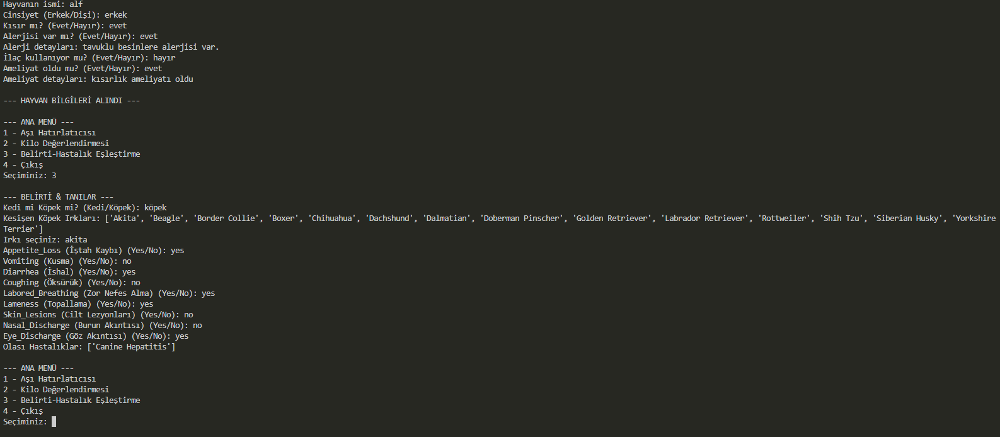

#  cansu_torunoglu_veteriner_kaydi_projesi

##  Projenin Tanımı 

Bu Python projesi, kedi ve köpek patili dostlarımız için terminal tabanlı bir Veteriner Takip Sistemi sunar. 

Uygulama, aşı takvimi hatırlatıcısı, kilo kontrolü ve hastalık-belirti eşleştirme modüllerinden oluşur. Kullanıcıdan alınan bilgiler doğrultusunda analiz ve tavsiyeler sunar.

## Projenin Amacı

Hayvan sağlığına dair önemli bilgileri dijital ortamda bir araya getirerek:

- Aşı takibini kolaylaştırmak

- Sağlıklı kilo aralıklarına dikkat çekmek
  
- Semptomlara göre olası hastalıkları önceden tahmin edebilmek
  
amaçlarıyla geliştirilmiştir.

## Hangi Sorunlara Çözüm Sunar?

Aşı tarihi ne zamandı? sorusuna otomatik yanıt.

Aşırı kilo/kilo düşüklüğünü erken fark etme

Belirtilere göre hastalık tahmininde bulunur.

İlaç kullanımı, alerji ve ameliyat geçmişi takibi yapar.

Not : Verilerin kesişimi ile yalnızca güvenilir ve desteklenen kedi/köpek ırkları işleme alınır.

##  Kullanım Senaryosu

1- Kullanıcı uygulamayı başlatır ve hayvan bilgilerini girer.

 İsim, cinsiyet, kısırlık durumu, alerji/ilaç/ameliyat bilgileri
 
2- Ana menüden bir modül seçilir:

   Aşı Hatırlatıcı
   
   Kilo Kontrolü
   
   Belirti-Hastalık Eşleştirme
   
3- İlgili veri alınır ve analiz gerçekleştirilir

4-Sonuçlar kullanıcıya metin olarak sunulur


## Kurulum

1. Python **3.11+** kurulu olmalı.

2. Gerekli kütüphaneleri kurun:

   ```bash
   pip install pandas requests openpyxl

3.Proje sayfasına git:  
   [https://github.com/CansuTorunoglu/veterinerlik_kaydi_otomatiklesmis_sistem](https://github.com/CansuTorunoglu/veterinerlik_kaydi_otomatiklesmis_sistem)

4.Sağ üstteki `Code` butonuna tıklayın.

5.Açılan pencereden `Download ZIP` seçeneğine tıklayın.

6.ZIP dosyasını bilgisayarınıza indirin ve ayıklayın.

7.Zip dosyasındaki dosya .py uzantılı olduğundan bir IDE ile birlikte açarak kullanmaya başlayabilirsiniz.

## Kullanılan Kütüphaneler 
   
  pandas = CSV ve Excel gibi tablo formatlı dosyaları okur, yazar ve düzenler.
  
  requests = İnternetteki (GitHub gibi) bir dosyayı program içine çeker (download gibi ama kodla).
  
  openpyxl = .xlsx uzantılı modern Excel dosyalarını pandas ile birlikte okuyabilmek için kullanılır.

  datetime = Python’un yerleşik modülüdür. Aşıların bir sonraki tarihini hesaplamak için tarih işlemleri yapılır.
  
  io = İnternetten gelen Excel dosyalarını pandas ile açabilmek için bellek içi byte akışını sağlar.


## Uygulama Modülleri

 ### Modül 1: Aşı Hatırlatıcı
 
1-Kullanıcı hayvan türünü ve yaş grubunu seçer (Yavru/Yetişkin).

2-Seçilen hayvan türü (kedi/köpek) ve yaş grubuna (yavru/yetişkin) göre aşılar belirlenir.

3-Mevcut aşı listesinden yapılanlar seçilir ve yapılma tarihi/tarihleri girilir.

4-Sistem, yapılan aşıların son tarihine göre bir sonraki dozu hesaplar.

5-Yapılmamış aşılar listelenir.

#### Aşı Takvimi (Seçilene göre farklılık gösterir)

Yavru hayvanlarda doz aralıkları  daha sık ve kademelidir:

-Yavru köpekte karma-bronşit ve korona 1. dozdan sonra 2. doz 21 gün sonra ardından tüm tekrar dozları yılda 1 dir.

-Yavru kedide karma-bronşit-lösemi ve korona 1. dozdan sonra 2. doz 14 gün sonra ardından tüm tekrar dozları yılda 1 dir.

-Yavru kedi/köpekte iç dış 2 ay kuduz yılda 1 dir.

-Yetişkin kedi ve köpekte yılda 1 ve 1 tekrar şeklinde hatırlatma dozu uygulanır
Kedi için lösemi aşısı varken köpek için lösemi aşısı istenmez.


###  Modül 2: Kilo Kontrolü

Hayvanın türü ve ırkına göre kilo aralığı belirlenir

Kullanıcı mevcut kilosunu girer

Sonuç: "Kilo düşük", "Kilo fazla" veya "Kilo normal"


###  Modül 3: Belirti-Hastalık Eşleştirme

Kullanıcı belirti listesinden (9 belirti) seçim yapar.

Sistem, belirtilere göre veri kümesindeki olası hastalıkları filtreler

Tüm belirtileri eşleşen olası hastalık var ise listelenir.


 ## Kullanılan Veri Setleri

kedi_boy_kilo.csv: Kedilerin ideal kilo aralıkları

kopek_boy_kilo.csv: Köpeklerin ideal kilo aralıkları

kedi_kopek_hastalik.xlsx: Irk, hayvan türü ve belirtilere göre hastalık eşleşmeleri


 ### Veri Seti Notu
 
Tüm veriler GitHub üzerinden çevrimiçi olarak çekilmektedir. Manuel veri yükleme gerekmez.

Bu veri setlerinin kesişiminde bulunan ırklarla analiz yapılır.


## Yardım Nereden Alınabilir?

GitHub Issues sekmesinden sorun bildirilebilir.

## Geliştirici Bilgisi
Ad: Cansu Torunoğlu

Bölüm:Hacettepe Üniversitesi, İstatistik Bölümü


## Örnek Kullanım Çıktıları


Tüm semptomları kapsayan hastalık eşleşmesi


Bir sonraki yapılması gereken aşının otomatik olarak belirlenmesi


Veri setinde bulunan ırklara özgü kilo aralıkları için kilo kontrolü

